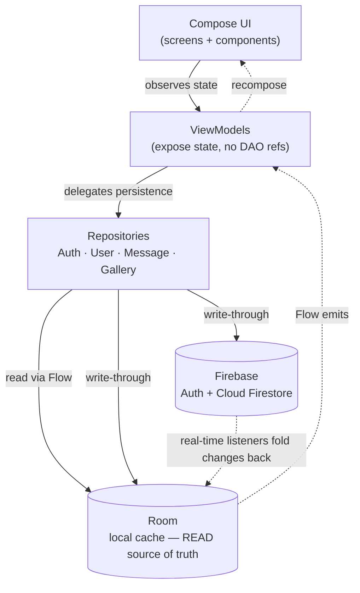
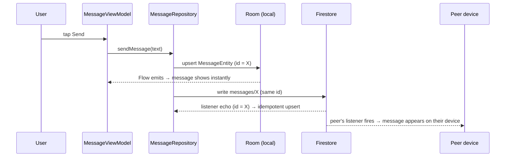
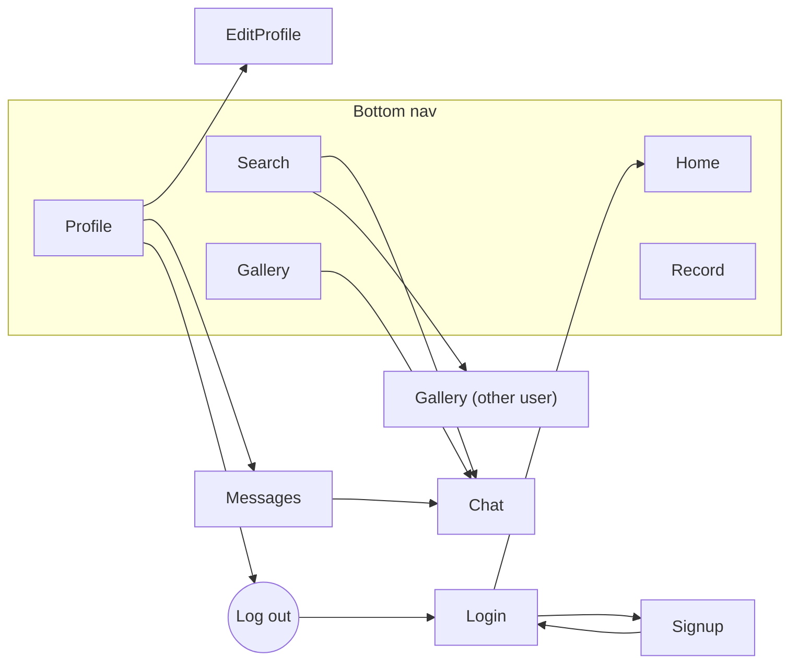

# Enerva — Master Design & Architecture Document

> **Enerva** is an Android app for *social cardio* — track your runs, walks, and rides; capture them as reels; discover and follow other runners; chat; and keep each other moving. Inspired by Strava, built as a modern Android engineering showcase.

- **Platform:** Android (min SDK 24, target SDK 36)
- **Language:** Kotlin
- **UI:** Jetpack Compose + Material 3 (single-Activity)
- **Architecture:** MVVM + an **offline-first Repository layer**
- **Persistence:** Room (local, source of truth for reads) + Cloud Firestore (cloud, write-through + real-time sync)
- **Auth:** Firebase Auth — email/password + Google Sign-In (Credential Manager)
- **Package:** `com.example.a211198_hasif_drnelson_Project2`

---

## Table of Contents

1. [Concept & Problem](#1-concept--problem)
2. [Tech Stack](#2-tech-stack)
3. [Architecture](#3-architecture)
4. [Project Structure](#4-project-structure)
5. [Data Model](#5-data-model)
6. [Screen Map & Navigation](#6-screen-map--navigation)
7. [Security Model](#7-security-model)
8. [Roadmap & Phase History](#8-roadmap--phase-history)
9. [Code-Quality & Refactor Backlog](#9-code-quality--refactor-backlog)
10. [UX Improvements](#10-ux-improvements)

---

## 1. Concept & Problem

### The problem
People want stronger health and a fitter body, and they turn to cardio — jogging, running, brisk walking — to get there. But the journey usually ends too soon: **motivation fades, routines break, routes feel uncertain, progress is hard to measure, and going it alone makes cardio a struggle instead of a habit.** When people give up, they lose the chance to build lasting fitness and the quality of life that comes with it.

### The idea
Enerva attacks the *motivation* problem with three levers:

| Lever | How Enerva delivers it |
|-------|------------------------|
| **Measure progress** | GPS-tracked activities with live distance / pace / time, saved to a personal history. |
| **Make it social** | Follow other runners, see their reels, message them, form group chats — accountability through community. |
| **Make it shareable** | Every run can become a **reel** (an Instagram-style post) on your gallery, so progress is something you show, not just log. |

### Target user
A casual-to-intermediate runner who wants Strava-style tracking **plus** a lighter, more social, reel-first feed — and who values that the app keeps working offline and syncs when back online.

### Feature at a glance
- 📍 **Record** — real-time GPS activity tracking (run / walk / ride).
- 🎞️ **Gallery (Reels)** — per-user feed of captured activities; view your own and others'.
- 👥 **Social** — search, follow, profile pages, cross-device discovery.
- 💬 **Messaging** — 1:1 and group chat, synced across devices.
- 🗺️ **Routes** — browse and bookmark suggested weekend routes.
- 🔐 **Accounts** — email/password + Google sign-in, password reset.

---

## 2. Tech Stack

| Concern | Library | Why it's here |
|---------|---------|---------------|
| UI toolkit | Jetpack Compose + Material 3 | Declarative, modern, less boilerplate than XML; Material 3 theming. |
| Navigation | Navigation-Compose | Single-Activity navigation graph with typed routes + transitions. |
| Local DB | Room (KSP) | Typed, queryable offline cache; `Flow` queries drive reactive UI. |
| Cloud DB | Cloud Firestore | Real-time, offline-capable document store for cross-device sync. |
| Auth | Firebase Auth + Credential Manager + Google ID | Per-user accounts, password reset, Google Sign-In (current recommended API). |
| Async | Coroutines + Flow | Structured concurrency; `Flow` bridges Room/Firestore → Compose state. |
| Images | Coil (`AsyncImage`) | Lightweight Compose-native image loading (drawables + `content://` URIs). |
| Location | Play Services Location (`FusedLocationProviderClient`) | Battery-efficient GPS for activity tracking. |
| Camera | CameraX | Activity media capture (wired in Phase 5). |
| Networking | Retrofit + Moshi + OkHttp | Present for future REST integrations (e.g. Maps/places). |
| Prefs | DataStore (Preferences) | One-time flags (e.g. demo-seed gate) and lightweight session prefs. |
| Permissions | Accompanist Permissions | Compose-friendly runtime permission flow. |

> **Note:** Retrofit/Moshi/OkHttp are wired but not yet exercised by a live API — reserved for Maps/places work in Phase 4.

---

## 3. Architecture

Enerva is **MVVM with an offline-first Repository layer**. The defining choice: **Room is the read source of truth; Firestore is a write-through target and a push source.** The UI never waits on the network to render — it reads local data instantly, and cloud changes flow back in through listeners.

### 3.1 Layered overview



**Layer responsibilities**

| Layer | Owns | Does NOT |
|-------|------|----------|
| **UI (Compose)** | Rendering, user input, navigation calls. | Touch Room/Firestore directly. |
| **ViewModel** | Holding observable UI state, exposing intent methods. After the Phase-3 refactor, ViewModels hold **no DAO references** — they delegate to repositories. | Make persistence decisions. |
| **Repository** | The single owner of a domain (profile, messages, reels): decides read-from-Room, write-to-both, run listeners, reconcile cloud ↔ local. | Hold UI state. |
| **Room** | Local cache + offline reads via `Flow`. | Be the cloud truth. |
| **Firebase** | Identity (Auth) and the cross-device truth (Firestore). | Block the UI. |

### 3.2 Why offline-first

- **Instant UI** — reads hit Room, never the network, so there's no spinner on every screen.
- **Works offline** — writes land in Room immediately; Firestore's SDK queues them and replays on reconnect.
- **Self-healing sync** — snapshot listeners fold remote changes into Room, and because Room exposes `Flow`, the UI auto-refreshes with no manual wiring.
- **Idempotent echoes** — a record is written to Room and Firestore under the **same id**, so when the listener echoes the change back it's a no-op rather than a duplicate.

### 3.3 Data-flow walkthrough — "send a chat message"



The same pattern repeats for profile edits (`users/{uid}` + `publicProfiles/{uid}`) and reels (`users/{uid}/media` + `publicReels/{mediaId}`).

### 3.4 Identity & session

- Auth state lives in `FirebaseAuth.currentUser` (replaces the old `activeEmail` preference).
- On app start, `MainActivity` picks the start route: **Home** if a Firebase user exists, else **Login**.
- On sign-in, the repository **backfills `firebaseUid`** onto the local user row and starts listeners; on logout it tears them down and clears active-user state in the ViewModels.
- **Key bridge:** Room keeps `email` as its primary key (the offline cache and every query is email-keyed), while Firestore keys on the immutable Firebase `uid`. The indexed `firebaseUid` column maps each local row to its cloud doc.

### 3.5 Cross-device discovery

Owner-only security rules mean a user can't read another user's private `users/{uid}` subtree. To still let people **discover** each other, Enerva mirrors a *public slice* into two top-level collections any signed-in user can read:

- `publicProfiles/{uid}` → name, location, fitness level, photo → mirrored into the local `user_directory` table → powers **Search**.
- `publicReels/{mediaId}` → the public copy of a reel → folded into Room → powers the cross-user **Gallery feed**.

Private data (`users/{uid}`, conversations) stays locked to its owner/participants.

---

## 4. Project Structure

```
com.example.a211198_hasif_drnelson_Project2
│
├── RunTrackApplication.kt        # App entry: inits Firebase + Room, owns repo singletons
│
├── model/                        # Plain UI/domain models (not Room entities)
│   ├── UserData.kt               #   profile model the ViewModel exposes
│   ├── GalleryActivity.kt        #   a reel as the UI sees it
│   ├── RunRoute.kt               #   suggested weekend route
│   ├── ActivityRecord.kt         #   completed activity (UI model)
│   ├── Message.kt                #   chat message (UI model)
│   └── (legacy: Club, Challenges, Friends, Notifications, Workout — see §9)
│
├── data/                         # Persistence layer
│   ├── AppDatabase.kt            #   Room DB (v5) + migrations + singleton
│   ├── entities/Entities.kt      #   @Entity definitions (8 tables)
│   ├── dao/                      #   UserDao, MessageDao, ActivityDao (Flow + suspend)
│   ├── cloud/FirestoreSchema.kt  #   collection-name constants + Firestore DTOs
│   └── repository/               #   domain owners (the heart of the data layer)
│       ├── AuthRepository.kt     #     Firebase Auth wrapper
│       ├── GoogleSignInHelper.kt #     Credential Manager → Google ID token
│       ├── UserRepository.kt     #     profile, follows, saved routes, directory
│       ├── MessageRepository.kt  #     conversations + messages
│       └── GalleryRepository.kt  #     reels (own + public feed)
│
├── view_model/                   # MVVM ViewModels
│   ├── UserViewModel             #   profile/session/follows  (file to rename — §9)
│   ├── MessageViewModel.kt       #   chat + groups
│   ├── GalleryViewModel.kt       #   reels (feed / mine / by-author)
│   ├── RecordViewModel.kt        #   GPS tracking state machine
│   ├── LoginViewModel            #   login form state  (file to rename — §9)
│   └── SignupViewModel           #   signup form state (file to rename — §9)
│
├── view/                         # UI layer
│   ├── MainActivity.kt           #   single Activity, hosts Scaffold + NavHost + Record FAB
│   ├── Navigation.kt             #   Screen sealed class, route builders, bottom-nav list
│   ├── components/HomeTopBar.kt  #   shared composables
│   └── screen/                   #   one file per screen (Login, Signup, Home, Profile,
│                                 #     EditProfile, Record, Gallery, Search, Message, Chat)
│
└── ui/theme/                     # Color.kt, Theme.kt, Type.kt (Material 3 theme)
```

**Boundary rule:** dependencies point downward only — `view` → `view_model` → `data/repository` → `data/{dao,cloud}`. The UI never imports a DAO; a ViewModel never imports Firestore directly.

---

## 5. Data Model

### 5.1 Room entities (local, `runtrack.db`, v5)

| Entity | Key | Purpose |
|--------|-----|---------|
| `UserEntity` | `email` (PK), `firebaseUid` (indexed) | The signed-in account on this device (private cache). |
| `UserDirectoryEntity` | `uid` | Public mirror of *other* users (from `publicProfiles`) for Search. |
| `SavedRouteEntity` | `ownerEmail`+`title` | Bookmarked weekend routes. |
| `FollowEntity` | `ownerEmail`+`friendName` | Who the user follows. |
| `ActivityRecordEntity` | `id` (UUID) | A completed run/walk/ride. |
| `ConversationEntity` | `ownerEmail`+`friendName` | A 1:1 or group conversation; `conversationId` links to the shared cloud doc. |
| `MessageEntity` | `id` | One chat message; `conversationId` mirrors the parent. |
| `MediaEntity` | `id` | One gallery reel (own post or seeded demo). |

### 5.2 Firestore schema (cloud)

```
users/{uid}                              ← private, owner-only
   ├─ email, runnerName, location, fitnessLevel, personalGoal, bio
   ├─ following (int), followers (int), photoUri (string?), createdAt
   ├─ follows/{friendKey}        ← friendName, friendUid, createdAt
   ├─ savedRoutes/{title}        ← distance, time, elevation, difficulty, imageRes
   ├─ activities/{activityId}    ← type, title, date, distanceKm, durationMinutes, …
   └─ media/{mediaId}            ← caption, activity, distanceKm, tint, imageRes, likes, …

conversations/{conversationId}           ← shared between participants
   ├─ participants: [uid…], participantNames: {uid→name}
   ├─ isGroup, groupName, lastMessageAt
   └─ messages/{messageId}       ← senderUid, text, timestampMs

publicProfiles/{uid}                     ← public: any signed-in user may read
   └─ runnerName, location, fitnessLevel, photoUri

publicReels/{mediaId}                    ← public: any signed-in user may read
   └─ ownerUid, author, caption, activity, distanceKm, tint, imageRes, likes, …
```

### 5.3 The email ↔ uid bridge

| | Room | Firestore |
|--|------|-----------|
| **Primary key** | `email` | Firebase `uid` |
| **Why** | Emails are how the local cache + every DAO query was originally written. | uids are immutable and required by security rules. |
| **Link** | `UserEntity.firebaseUid` (indexed), backfilled on first cloud sign-in. | — |

**Conversation id derivation:** a 1:1 `conversationId` is derived deterministically from the two **sorted uids**, so both devices compute the same id with no lookup. Group chats use a generated UUID stored on the local row.

### 5.4 Migrations (data-preserving)

- **v3 → v4** (`MIGRATION_3_4`): additive nullable `ADD COLUMN`s — `users.firebaseUid` (+ index), `conversations.conversationId`, `messages.conversationId`.
- **v4 → v5** (`MIGRATION_4_5`): additive `CREATE TABLE user_directory`.
- A `fallbackToDestructiveMigration` exists only for version paths without a written migration (dev safety net).

---

## 6. Screen Map & Navigation

Single-Activity, 10 screens, **5 bottom-nav tabs**. The Record tab is presented as a large central FAB straddling the nav bar.



| # | Screen | Role |
|---|--------|------|
| 1 | **Login** | Launch screen; email/password, Google, forgot-password. |
| 2 | **Signup** | Create account → bounce back to Login. |
| 3 | **Home** | Dashboard: your progress reels + suggested weekend routes. |
| 4 | **Profile** | Stats, gallery grid, follows, log out. |
| 5 | **Messages** | Inbox + group creation. |
| 6 | **Edit Profile** | Update name, photo, bio, goals. |
| 7 | **Record** | GPS tracking + route search/filters (merged Record+Maps). |
| 8 | **Gallery** | Reels feed (own + others'); per-user galleries. |
| 9 | **Search** | Discover users to follow / message. |
| 10 | **Chat** | 1:1 / group conversation. |

> **Design decisions (locked):** launch on Login (no Welcome screen); Settings deleted → only Log out survives (in Profile); Groups deleted → group chat lives in Messages; Activity history deleted → shown as reels in Gallery; Record + Maps merged into one screen.

---

## 7. Security Model

Firestore rules (`firestore.rules`, rules_version 2):

| Path | Read | Write |
|------|------|-------|
| `users/{uid}/**` | owner only (`auth.uid == uid`) | owner only |
| `conversations/{id}` | participants only (`auth.uid in participants`) | participant; `create` validates the creator is in `participants` |
| `conversations/{id}/messages/{mid}` | participants (via parent `get()`) | `create` requires `senderUid == auth.uid`; update/delete denied (messages immutable) |
| `publicProfiles/{uid}` | any signed-in user | owner only |
| `publicReels/{mediaId}` | any signed-in user | owner only (`ownerUid == auth.uid`) |

**Profiles stay private *and* chat labels resolve** because participant display names are denormalised onto the conversation doc (`participantNames: uid→name`), so a chat doesn't need to read the other user's private profile.

> **Status:** rules written; **deploy pending** (`firebase deploy --only firestore:rules` or paste into Console). New public collections are denied until redeployed.

---

## 8. Roadmap & Phase History

Each phase ends **buildable**. Phases 4 & 5 need credentials (Maps API key).

| Phase | Description | Status |
|-------|-------------|--------|
| 0 | Package rename (`Project1` → `Project2`) | ✅ Done |
| 1 | Trim & restructure to 10 screens | ✅ Done |
| 2 | Room (local persistence) | ✅ Done |
| 3 | Firebase Auth + Cloud Firestore | ✅ Code-complete (rules deploy + on-device checkpoint pending) |
| 4 | Google Maps API (real map) | 🔜 Next |
| 5 | Camera in Record screen | 🔜 Upcoming |

### Phase 3 sub-tracker (Firebase)

| # | Sub-phase | Status |
|---|-----------|--------|
| 5.0 | Firebase console setup (project, JSON, Auth, Firestore) | ✅ Done |
| 5.1 | Gradle wiring (BoM, plugin, deps) | ✅ Done |
| 5.2 | Schema migrations (Room v4 + `firebaseUid` + `conversationId`) | ✅ Done |
| 5.3 | Repositories + Firestore listeners (User / Message / Gallery) | ✅ Code-complete; on-device sync unverified |
| 5.3a | Cross-device discovery (`publicProfiles` + `publicReels`) | ✅ Code-complete; needs rules redeploy + test |
| 5.4 | Auth — email/password | ✅ Done |
| 5.4a | Signup → Login redirect | ✅ Done |
| 5.4b | Google Sign-In (Credential Manager) | ✅ Done & verified on-device |
| 5.4c | Forgot password (email reset) | ✅ Done & verified |
| 5.5 | Security rules | ✅ Written; ⏳ **deploy pending** |
| 5.6 | Manual cross-install checkpoint | ⏳ Last |

> **Implementation notes worth keeping:**
> - **Google Sign-In** uses `GetSignInWithGoogleOption` (button-driven, always shows the picker) — `GetGoogleIdOption` threw `NoCredentialException` on an explicit press. `AuthUser` carries `displayName` + `photoUrl` to seed a new profile.
> - **Network gotcha:** on TLS-inspecting WiFi (campus/office), GMS can't hold the HTTP/2 connection to Google's auth servers (`ERR_HTTP2_PING_FAILED`). Use mobile data / an unrestricted network. Don't battery-restrict Google Play services on ColorOS/Realme.
> - **Cross-user feed scope:** owner-only rules forbid reading others' `users/{uid}/media`, so the public feed is served by the `publicReels` collection (not direct reads).
> - **Image limitation:** `imageRes` (drawable id) and `imageUri` (`content://`) are device-local — synced reels carry text/stats across devices but **not the picture** until Phase 5 adds Firebase Storage.

### Phase 4 — Google Maps (real map in Record)
1. Add `maps-compose` + `play-services-maps`.
2. Maps API key via `local.properties` / secrets plugin (**never commit the key**).
3. Replace the `Canvas` breadcrumb backdrop with a `GoogleMap` composable.
4. Draw the live trail as a `Polyline` from `RecordViewModel.path`; add a current-location marker.
5. Wire the currently-inert map action buttons (layers / 3D / recenter) and route filters.
6. **Checkpoint:** live GPS path on a real map.

### Phase 5 — Camera in Record
1. Add `CAMERA` permission.
2. CameraX capture (`PreviewView` + `ImageCapture`) using existing deps.
3. Capture button on Record; request camera + location permissions.
4. Save media → `MediaEntity` + upload to **Firebase Storage** (gives real cross-device images).
5. Captured media appears in Gallery reels.
6. **Checkpoint:** capture from Record → appears in Gallery on another device.

---

## 9. Code-Quality & Refactor Backlog

Concrete, low-risk cleanups found while auditing the codebase. None change behaviour; all raise the bar for a portfolio reader.

| Priority | Item | Why |
|----------|------|-----|
| **P1** | **Rename ViewModel files to match their class.** `view_model/UpdateLoginScreen.kt` contains `LoginViewModel`; `UpdateSignupScreen.kt` and `UpdateUserViewModel.kt` likewise mismatch (and read like *screens* despite being VMs). Rename files → `LoginViewModel.kt`, `SignupViewModel.kt`, `UserViewModel.kt`. | File/class mismatch is the first thing a reviewer trips on; it implies the layering is muddled when it isn't. |
| **P1** | **Remove the hardcoded `(A211198)` matric string** from the Home "Your Progress" header (`HomeScreen.kt`). Show the user's name instead. | A student id leaking into production UI is an obvious tell and looks unfinished. |
| **P1** | **Refresh the README.** It still lists 16 screens (Notify/Settings/Groups/You/Main) and a `network/` package that no longer reflects reality. | The README is the front door; it currently contradicts the actual app. |
| **P2** | **Audit & remove orphaned `model/` files** left from the screen trim — `Club.kt`, `Challenges.kt`, `Notifications.kt`, `Workout.kt` (and verify `Friends.kt`). Confirm no live references before deleting. | Dead code inflates the surface area and confuses readers. |
| **P2** | **Add a smoke test suite.** Only the template `ExampleUnitTest` / `ExampleInstrumentedTest` exist. Add unit tests for repositories (id derivation, mappers) and DAO tests (Room in-memory). | "Has tests" is a baseline signal of engineering maturity. |
| **P2** | **Standardise the brand.** Code/package say `RunTrack` (e.g. `RunTrackApplication`, `RunTrackTheme`); the README/product is **Enerva**. Pick one and document the other as the internal codename. | Consistent naming reads as intentional. |
| **P3** | **Introduce Hilt** to replace the manual `ViewModelFactory` + `Application`-held singletons. | Cleaner DI; nice talking point, but the manual approach is fine and works — low urgency. |
| **P3** | **Extract magic numbers / strings** (FAB sizing math, filter labels, status text) into named constants / `strings.xml`. | Readability + future localisation. |

> Suggested order: do the three **P1** items together (they're cosmetic but high-signal), then tests, then the rest opportunistically.

---

## 10. UX Improvements

Two tracks: **quick wins** that are realistically shippable solo and raise polish immediately, and a **vision** for where the product could go.

### 10.1 Quick wins (P1 — do these first)

| Area | Improvement |
|------|-------------|
| **Empty states** | Every list (Gallery feed, Search, Messages, Profile grid) should show a friendly illustration + one-line prompt + CTA instead of blank space. (Home already does this for "No posts yet" — extend the pattern.) |
| **Loading & error states** | Show skeletons/spinners while Room/Firestore hydrate, and a retry affordance on failure. Right now sync failures are largely silent. |
| **Record screen honesty** | The map backdrop is a placeholder grid and the action buttons/filters are inert. Either ship Phase 4's real map or visibly mark these as "coming soon" so they don't feel broken. |
| **Accessibility** | Add `contentDescription` to every meaningful icon, ensure 48dp minimum touch targets, and check colour contrast in the dark theme. |
| **Feedback on actions** | Replace silent toasts-or-nothing with consistent feedback: snackbars for errors, subtle confirmation for follows/saves/posts. |
| **Search UX** | Debounce input, show "no results" state, and make follow/message actions one tap with immediate optimistic feedback. |
| **Pull-to-refresh** | On feed/inbox screens, so users have an obvious way to force a sync. |
| **Form validation inline** | Login/Signup should show field-level validation (email format, password ≥ 6, password match) before submit, not just on failure. |

### 10.2 Vision (where Enerva could go)

| Theme | Idea |
|-------|------|
| **Motivation loops** | Streaks, weekly goals, and **achievements/badges** (first 5K, 7-day streak) — directly targets the "motivation fades" problem from §1. |
| **Social competition** | Friend & club **leaderboards** (weekly distance), kudos/reactions on reels, comments. |
| **Live & safety** | **Live activity sharing** ("a friend is running now"), live location share with a trusted contact for safety on solo runs. |
| **Smarter routes** | Real route discovery from the Maps/places API, surfacing routes by distance/elevation/difficulty near the user (the Record filters already hint at this). |
| **Rich reels** | Phase-5 camera capture + an auto-generated "run summary card" (map snapshot + stats) as the reel image. |
| **Coaching** | Lightweight training plans / suggested next workout based on recent activity — could later use an on-device or API model for personalised nudges. |
| **Notifications** | Re-introduce a focused notifications surface (new follower, message, friend finished a run) — but as push, not a dead screen. |

> The vision items are deliberately sequenced so each builds on shipped infrastructure: achievements/leaderboards reuse the activity + follow data already modelled; live sharing reuses the Firestore listener pattern; rich reels depend on Phase 5 (camera + Storage).

---

*Enerva is an educational / portfolio project — not a commercial product. Internal code uses the `RunTrack` codename; the product name is Enerva.*
